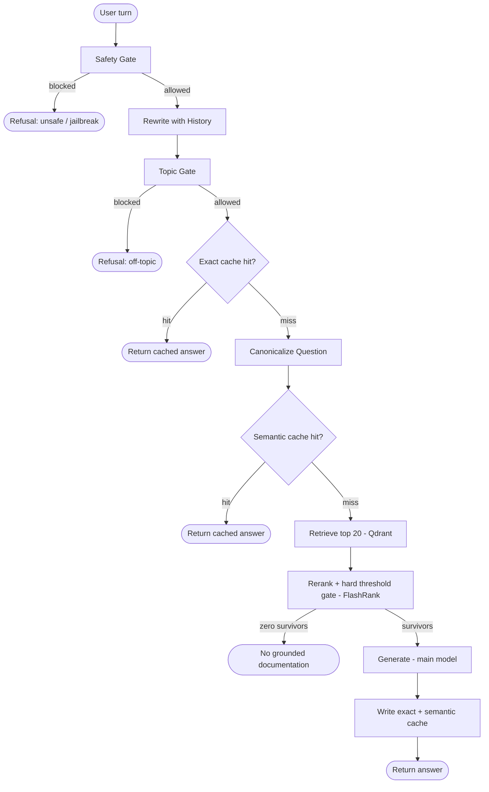

Full README, updated:```markdown
# Terraform Agentic RAG

A retrieval-augmented Q&A system for Terraform (HashiCorp IaC) questions, built to run entirely on a no-GPU, 16GB laptop by offloading every model-weight operation to free-tier hosted APIs. Local compute is limited to parsing, chunking, and CPU/ONNX reranking.

Not a scale project, a demonstration of the pieces that separate a "wrap an LLM around a vector search" demo from something closer to production shape: two-layer caching with intent preservation, structure-aware chunking that respects HCL block boundaries, a hard-gated reranker instead of similarity-only retrieval, provider failover, and full request tracing.

## Architecture



- **Safety Gate** runs on the raw message, before any other LLM call, so a jailbreak attempt is rejected before it costs a planner call.
- **Topic Gate** runs on the rewritten standalone question, so context-dependent follow-ups aren't misjudged as off-topic in isolation.
- Both gates **fail closed**, a classifier error blocks the request rather than letting it through.
- **Exact cache** and **semantic cache** are two independent layers: exact match is cheap with zero false-positive risk but only catches identical questions; semantic cache catches paraphrases but relies on the canonicalization step to preserve intent (e.g. "create" vs "destroy") before the embedding similarity check runs.
- **Rerank + gate** is two distinct operations: FlashRank reorders candidates by relevance, then a hard score threshold drops anything below it entirely, reordering alone doesn't filter noise out of what reaches the generator.

Implemented as a LangGraph state machine (`src/graph.py`), not a linear script, every node is independently callable and independently testable.

## Tech stack

- **Orchestration:** LangGraph  
- **LLMs:** NVIDIA NIM (primary), Groq (fallback)  
- **Guardrails:** NVIDIA NemoGuard (content safety & topic control)  
- **Embeddings:** Google Gemini (`gemini-embedding-001`)  
- **Vector database:** Qdrant  
- **Reranking:** FlashRank (cross-encoder)  
- **Caching:** SQLite (exact cache), Qdrant (semantic cache)  
- **Document processing:** BeautifulSoup4, PyMuPDF, python-docx, python-pptx, Markdown parsing, HCL-aware chunking  
- **Evaluation:** RAGAS  
- **Tracing & observability:** Logfire  
- **Frontend:** Streamlit  
- **Testing:** pytest

## Provider roles

| Role | Primary | Fallback | Why |
|---|---|---|---|
| Main generation | NVIDIA NIM | Groq | retry-then-failover; NIM's RPM-only free tier suits a chatty pipeline better than Groq's tight TPM cap, Groq catches NIM outages |
| Planner (rewrite, canonicalize) | NIM, small model | Groq, small model | kept off the main generation model's rate budget entirely |
| Guardrails | NIM NemoGuard (topic-control + content-safety) | none, fails closed | purpose-built classifiers, not a general LLM self-policing via system prompt |
| Embeddings | Google Gemini, `gemini-embedding-001`, truncated to 768 dims | none | GA, free tier, 768 dims keeps Qdrant storage well under free-tier limits |
| Eval judge | Groq |, | deliberately separate from whatever's serving live traffic |

Exact model IDs live in `.env.example` / `src/config.py`, not hardcoded in the pipeline logic.

## Setup

```bash
python3 -m venv venv && source venv/bin/activate   # Windows: venv\Scripts\activate
pip install -r requirements.txt
cp .env.example .env   # fill in NVIDIA_NIM_API_KEY, GROQ_API_KEY, GEMINI_API_KEY, QDRANT_URL, QDRANT_API_KEY

pytest tests/ -v

python ingest.py --official-dir data/official --community-dir data/community

streamlit run streamlit_app.py
```

`data/official/` and `data/community/` ship with a small synthetic Terraform doc corpus (original content, not scraped) so the pipeline is testable out of the box, swap in real docs for anything beyond a demo.

## Configuration: the two threshold knobs

Both live in `.env`, both need empirical tuning against your own corpus and query patterns, there's no universally correct value.

**`SEMANTIC_CACHE_SIMILARITY_THRESHOLD`** (default `0.95`), cosine similarity floor for a semantic cache hit.
- Too loose: unrelated questions return a stale cached answer.
- Too tight: genuine paraphrases ("what is X" vs "tell me about X") miss the cache and pay full generation cost every time. If you see this, check `canonicalize_question`'s output first, the canonicalizer is supposed to converge same-intent phrasings onto near-identical text before the embedding check ever runs. Lowering the threshold is the second lever, not the first.

**`RERANK_SCORE_THRESHOLD`** (default `0.5`), FlashRank cross-encoder score floor; anything below is dropped, not just deprioritized.
- Too loose: noisy, weakly-related chunks reach the generator and it hallucinates around them.
- Too tight: everything gets dropped and the system claims it has no documentation when it does. Cross-encoder scores are **not calibrated probabilities**, don't assume 0.5 means "50% confident." Before trusting any value, print the actual score distribution for a few real queries against your corpus (a quick REPL call to `src.rerank._ranker.rerank(...)` on a handful of retrieved candidates) and set the threshold relative to what you actually see, not the default.

## Project structure

```
rag-assistant/
│
├── streamlit_app.py                      # Streamlit chat UI (rerun-safe via st.chat_input)
├── ingest.py                             # CLI pipeline: parse → chunk → embed → upsert
│
├── src/                                  # Core RAG pipeline
│   ├── config.py                         # application settings, retrieval/rerank thresholds
│   ├── clients.py                        # NIM, Groq, Gemini & Qdrant client singletons with timeouts
│   ├── llm.py                            # retry-then-failover LLM wrapper
│   ├── embeddings.py                     # Gemini embedding generation + manual vector normalization
│   ├── guardrails.py                     # safety_gate() & topic_gate() (fail-closed)
│   ├── cache.py                          # exact-match and semantic caching layers
│   ├── parsers.py                        # PDF, HTML, TXT, DOCX & PPTX text extraction
│   ├── chunking.py                       # markdown-header & HCL-aware document chunking
│   ├── retrieval.py                      # Qdrant dense vector retrieval
│   ├── rerank.py                         # FlashRank reranking + hard relevance threshold
│   ├── graph.py                          # LangGraph orchestration/state machine
│   └── tracing.py                        # Logfire tracing and observability
│
├── data/
│
├── eval/
│   ├── eval_set.json                     # starter evaluation dataset
│   └── ragas_eval.py                     # RAGAS evaluation (6 retrieval & generation metrics)
│
├── tests/
│
├── .env.example                          # API keys for NIM, Groq, Gemini & Qdrant
├── .gitignore
├── requirements.txt                      # project dependencies
└── README.md                             # architecture, ingestion flow, setup, evaluation guide
```

## Testing

```bash
pytest tests/ -v
```

Every provider call is mocked, the suite runs with no real API keys and no network beyond `pip install`. `tests/test_chunking.py` runs against zero external dependencies and is worth reading first if you want to see the HCL-block-boundary logic actually exercised, including a regression test for a real bug (leading-whitespace drift in the block-start regex) caught by writing the tests, not assumed away.

## Evaluation

```bash
python eval/run_eval.py
```

Runs RAGAS's six metrics (faithfulness, answer relevancy, context precision/recall, context entity recall, semantic similarity) against `eval/eval_set.json`, judged by a model deliberately separate from whatever's serving live chat traffic. The included eval set is 8 hand-built pairs grounded in the shipped synthetic corpus, enough to confirm the eval path actually runs end-to-end, not a real benchmark. Extend it with real Q&A pairs before drawing conclusions from the scores.

## Intentionally simplified

- **Guardrails call NemoGuard directly** rather than through full NeMo Colang dialog rails, simpler to debug for a solo project, same two models, same fail-closed behavior. Extend by  swapping `src/guardrails.py`'s `_classify()` calls for a Colang-based `LLMRails` if you need multi-turn dialog policy rather than a single input/output classifier gate.
- **NemoGuard prompts are simplified**, not NVIDIA's exact published templates (which are more elaborate and the models were tuned against that specific phrasing). Functionally equivalent, but pull NVIDIA's real templates from the NeMo Guardrails docs before relying on this in production, this is the most likely place classification quality is being left on the table.
- **The eval set and doc corpus are both synthetic**, written for this project rather than scraped from real sources, for copyright reasons. Swap in real Terraform docs and a real hand-built eval set before treating either as representative.

## Known limitations

- FlashRank's cross-encoder score is not a calibrated probability, see the threshold section above.
- The `+0.02` official-source authority boost in `rerank.py` is a tie-breaker only, by design, it will not make a weakly-relevant official chunk outrank a strongly-relevant community one. If official sources aren't showing up for a topic, check whether the corpus actually has relevant official content before assuming the boost is broken.
- No conversation persistence, history lives in `st.session_state` and is lost on page reload. The exact/semantic caches persist independently of chat history, so repeated questions across sessions still benefit from caching even though the visible transcript doesn't.
- Single-user local demo, not multi-tenant. The exact cache is a local SQLite file (`.cache/exact`); the semantic cache lives in Qdrant and is shared across every session hitting the same Qdrant collection.